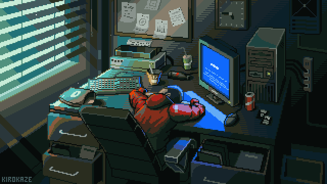

<div align="center">



<br>

[](https://git.io/typing-svg)

</div>

---

## 👋 About Me

Hi! I'm **Nadhif**, an Informatics student and developer who enjoys
turning ideas into digital projects.

I'm currently exploring software development, web development,
data, networking, IoT, and other technologies through hands-on projects.

> **Learn → Build → Break → Fix → Improve**

---

## 🛠️ Tech Stack

### 💻 Languages

<p>

</p>

### 🌐 Development

<p>

</p>

### 🗄️ Database & Tools

<p>

</p>

### 🌐 Other Technologies

<p>

</p>

---

## 🚀 Current Focus

- 📱 Flutter & Dart
- 🌐 Web Development
- 💻 Software Engineering
- 🗄️ Database
- 🌐 Computer Networking
- 🤖 IoT
- 📊 Data & Visualization

---

## 📌 Featured Project

### 🧬 BIOVERSE

An interactive biology learning platform built with Flutter Web.

<p align="center">

<a href="https://nadhiffaizurrahman270-glitch.github.io/BioVerse/">

</a>

<a href="https://github.com/nadhiffaizurrahman270-glitch/BioVerse">

</a>

</p>

---

## 📊 GitHub Statistics

<div align="center">


</div>

---

## 🔥 GitHub Streak

<div align="center">


</div>

---

## 📈 GitHub Activity

<div align="center">


</div>

---

## 🏆 GitHub Trophies

<div align="center">


</div>

---

## 🐍 Contribution Snake

<div align="center">


</div>

---

## 📊 Contribution Overview

<div align="center">


</div>

---

## 🎯 Goals

```text
████████████████████████████████████████  Learning
████████████████████████████████████░░░░  Building
██████████████████████████████░░░░░░░░░░  Exploring
████████████████████████████░░░░░░░░░░░░  Improving

```
## 💡 Developer Mindset

```text
while (learning) {
    build();
    improve();
    repeat();
}
```

### ⭐ Thanks for visiting my profile!

Building, learning, and improving one project at a time.
